# Examination Management System
## Overview

The Examination Management System is a web-based application designed to facilitate the management of courses, exams, and results within an educational institution. It supports three types of users: Super Admins, Professors, and Students. The system allows professors to create and manage exams, students to attend exams and view results, and super admins to oversee the entire process.

## Table of Contents

- [Features](#features)
- [Technologies Used](#technologies-used)
- [Setup and Installation](#setup-and-installation)
- [Project Structure](#project-structure)
- [Usage](#usage)
- [Contributing](#contributing)
- [License](#license)


## Features

- **Role-Based Access Control:** Different views and functionalities for super admins, professors, and students.
- **Exam Management:** Create, update, view, and delete exams.
- **Course Management:** Manage courses, including adding and removing students and professors.
- **User Management:** Administer user roles and permissions.
- **Real-Time Exam Attempt:** Students can take exams and view results immediately after submission.
- **Security:** JWT-based authentication and authorization.

## Technologies Used

- **Angular:** For building the dynamic and responsive user interface.
- **Angular Material:** For implementing Material Design components.
- **Froala Editor:** For a WYSIWYG editor to create and edit exam questions.
- **Monaco Editor:** For a code editor to solve coding questions.
- **Lazy Loading:** To optimize the application load time by loading modules as needed.

## Project Structure

- **src/app/modules/**
  - **admin:** Handles admin functionalities like user and course management.
  - **course:** Manages course-related operations.
  - **exam:** Contains components for creating and attempting exams.
  - **student:** Manages student-specific views and actions.
  - **auth:** Handles authentication, including login and token management.
  - **shared:** Contains shared components, services, and utilities.

## Usage

- **Login:** Users can log in with their credentials to access the system.
- **Dashboard:** Depending on their role, users will see a dashboard with relevant options.
- **Exam Management:** Admins can create and manage exams, while students can attempt them.
- **Result Display:** After submitting an exam, students can view their results.


## Link Demo:
  https://drive.google.com/file/d/1IWtkho7F-cd3mPD_lauaRmJ5iKLIUbOH/view?usp=drive_link

## Setup and Installation

1. **Clone the repository:**
   ```bash
   git clone https://github.com/AbdallahAhmed0/Examination-Management-System.git

2. **Install dependencies:**
   ```bash
   npm install

3. **Run the application:**
   ```bash
   ng serve
 
This project was generated with [Angular CLI](https://github.com/angular/angular-cli) version 14.2.2.
The application will run on http://localhost:4200/.


 ## ScreenShots
 
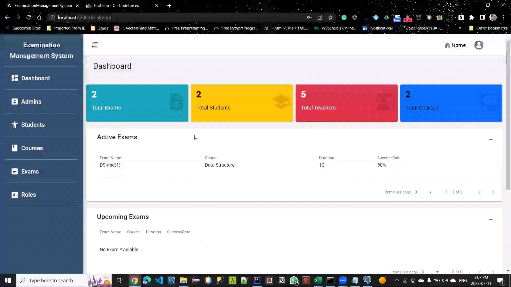
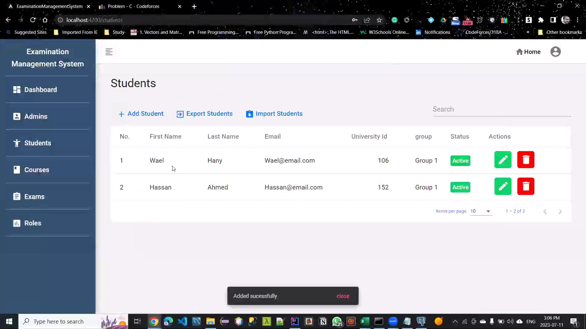
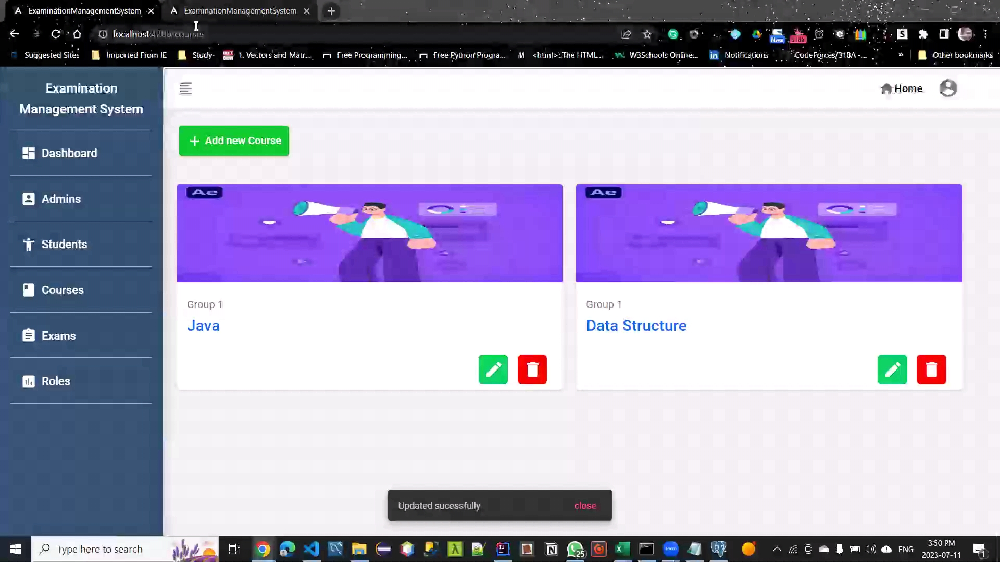
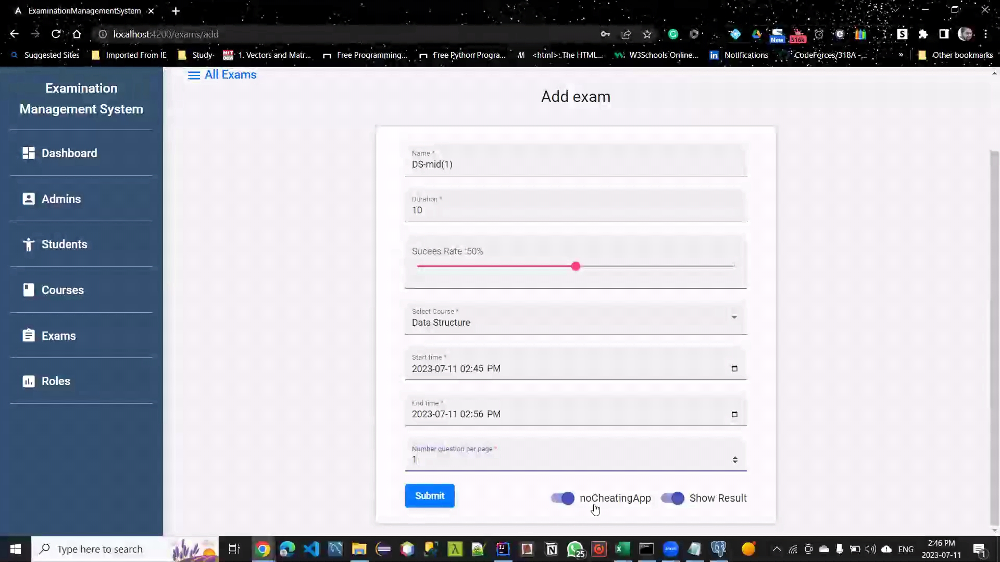
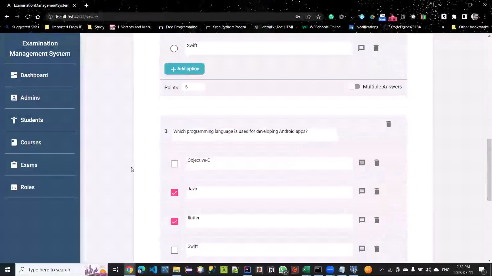
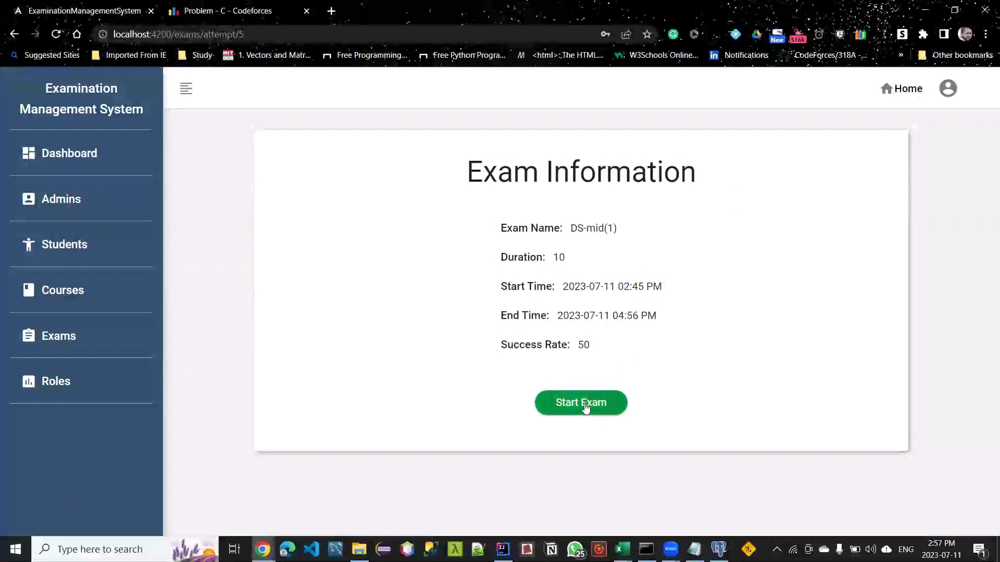
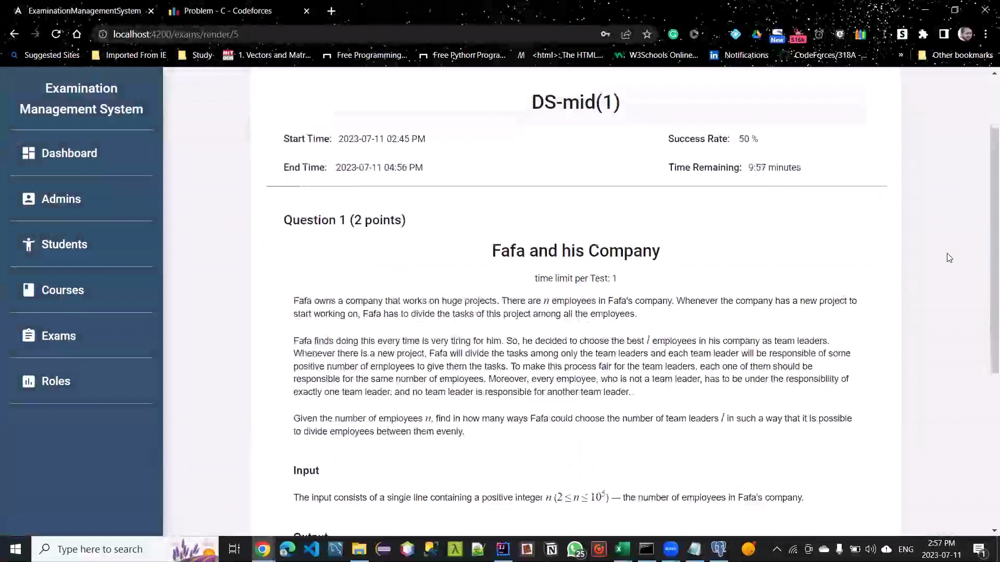
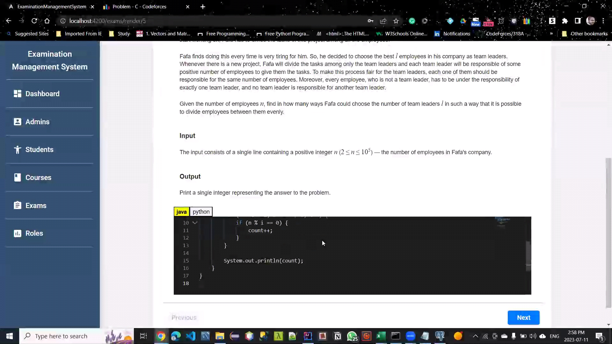
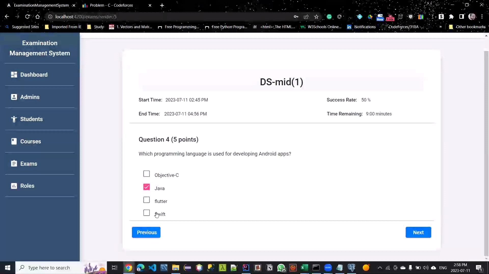
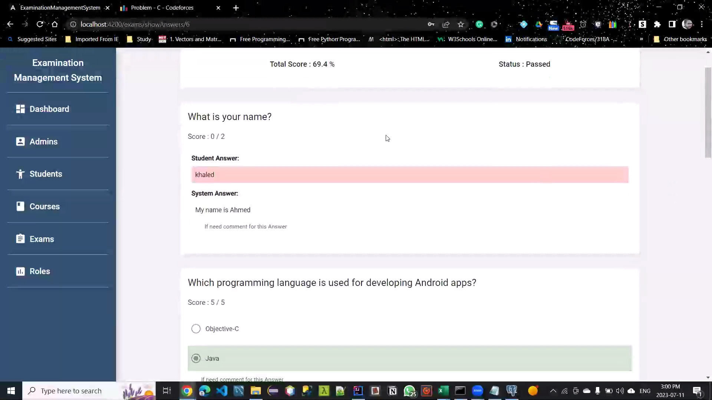
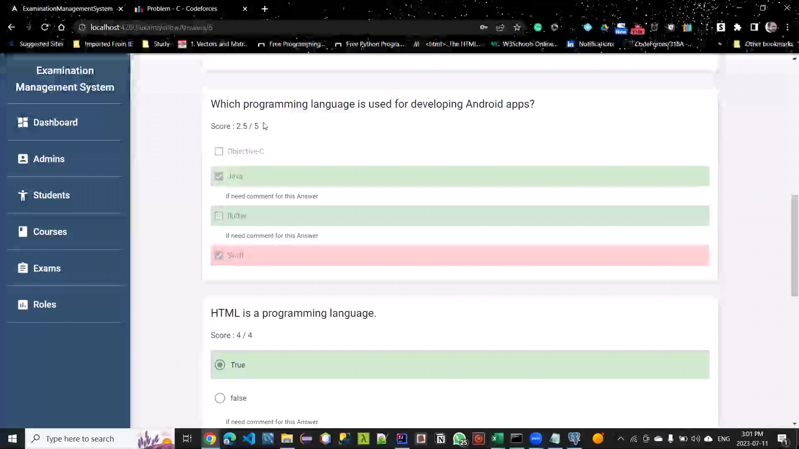

## License

This project is licensed under the MIT License - see the [LICENSE](LICENSE) file for details.

